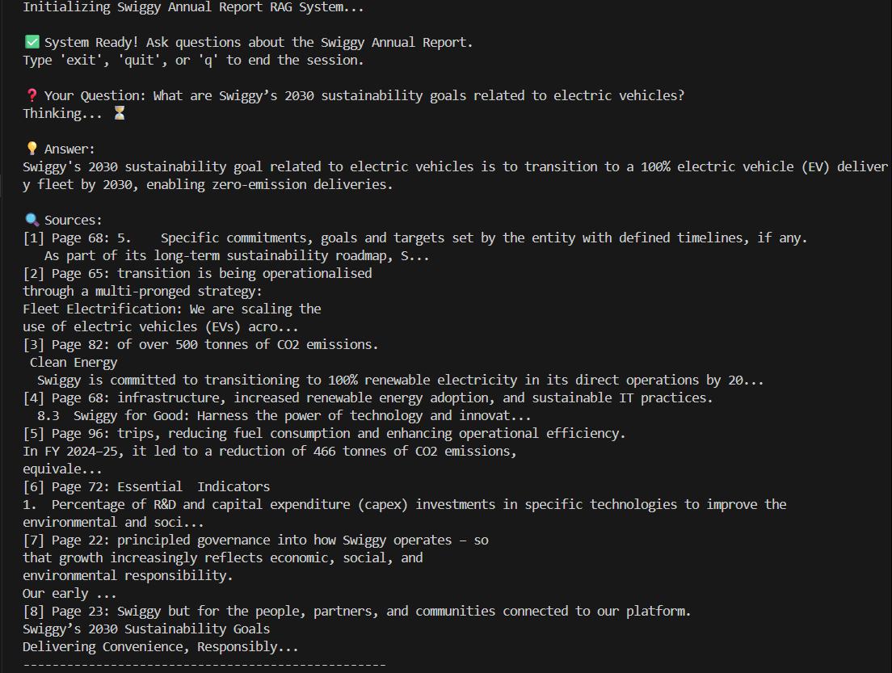
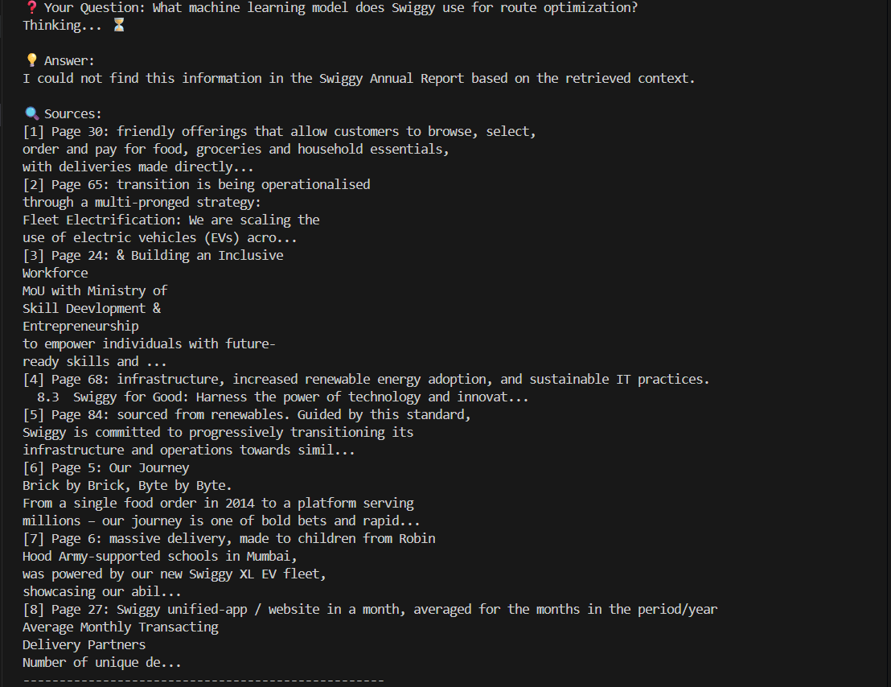

# Swiggy Annual Report RAG System

A production-ready Retrieval-Augmented Generation (RAG) system that allows users to ask questions about the Swiggy Annual Report (FY 2024-25) and receive accurate, context-grounded answers without hallucination.

## 🚀 Usage
1.  **Clone the repository**:
    ```bash
    git clone https://github.com/Ashish-kharde1/swiggy-annual-report-rag.git
    cd swiggy-annual-report-rag

    ```
2.  **Create a virtual environment**:
    ```bash
    python -m venv venv
    source venv/bin/activate  # On Windows use `venv\Scripts\activate`
    ```
3.  **Install Dependencies**:
    ```bash
    pip install -r requirements.txt
    ```

4.  **Set up Environment Variables**:
    - Create a `.env` file in the `project/` directory.
    - Add your Google API Key:
      ```
      GOOGLE_API_KEY=your_google_api_key
      ```

5.  **Ingest Data**:
    Process the PDF and generate embeddings (run once):
    ```bash
    python ingest.py
    ```

6.  **Run the Application**:
    Start the CLI to ask questions:
    ```bash
    python app.py
    ```

## 📸 Screenshots




## 🏗️ Architecture

1.  **PDF Loader**: Loads the Swiggy Annual Report PDF.
2.  **Text Splitter**: Chunks text into 1000-token segments with 150-token overlap for context preservation.
3.  **Embeddings**: Uses `HuggingFaceEmbeddings` (model: `sentence-transformers/all-MiniLM-L6-v2`) to convert text to vectors.
4.  **Vector Store**: Stores vectors locally using **FAISS** for efficient similarity search.
5.  **Retriever**: Fetches top-8 most relevant chunks using MMR (Maximal Marginal Relevance) for diverse context.
6.  **Generator**: **Gemini-2.5-Flash** generates answers using *only* the retrieved context, governed by a strict system prompt.

## 🛠️ Tech Stack

-   **Language**: Python 3.9+
-   **LLM**: Gemini-2.5-Flash (via `langchain-google-genai`)
-   **Embeddings**: HuggingFace Embeddings (sentence-transformers)
-   **Vector Store**: FAISS
-   **Orchestration**: LangChain
-   **PDF Processing**: PyPDF

## 🛡️ Anti-Hallucination Strategy

-   **Strict System Prompt**: The model is explicitly instructed to *only* use provided context and answer "I could not find this information" if the answer is missing.
-   **Low Temperature**: Temperature is set to `0` to maximize determinism and factual accuracy.
-   **Retrieval-First**: The model does not rely on its internal training data for facts about Swiggy's specific report details.


## 📄 Data Source

-   **File**: Swiggy Annual Report FY 2024-25
-   **Public Link**: [Swiggy Annual Reports](https://www.swiggy.com/corporate/wp-content/uploads/2025/07/Swiggy-Annual-Report-FY-2024-25.pdf)

## ⚠️ Known Limitations

Some financial metrics in the annual report appear primarily in visual KPI summaries or tables.
Due to PDF text extraction limitations, such metrics may not always be retrieved reliably.
In such cases, the system intentionally refuses to answer rather than inferring or hallucinating values.


---
